# docWithGithub
 使用Github写需求文档

## 注册Github账号

1. 打开 https://github.com/
2. 右上角 `Sign up`
3. 输入邮箱、密码后，按提示操作

## 下载Github客户端

1. https://desktop.github.com/
2. 点中间 `Download for Windows (64bit)`
3. 安装启动
   
   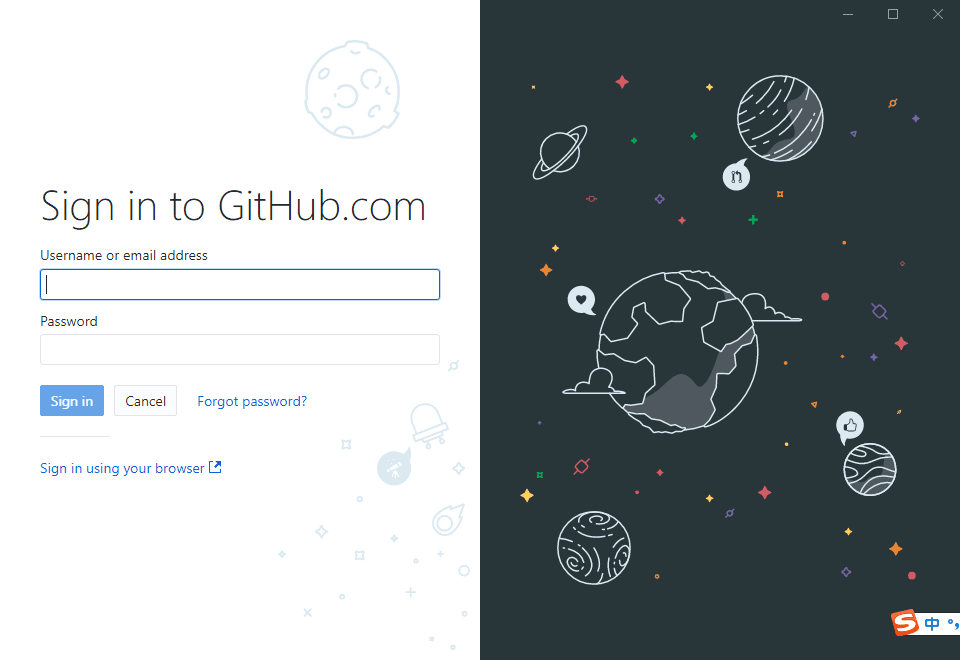
4. 输入刚才注册的账号密码登陆，或者点下方`Sign in using your browser` 使用浏览器登陆

## 创建项目文档

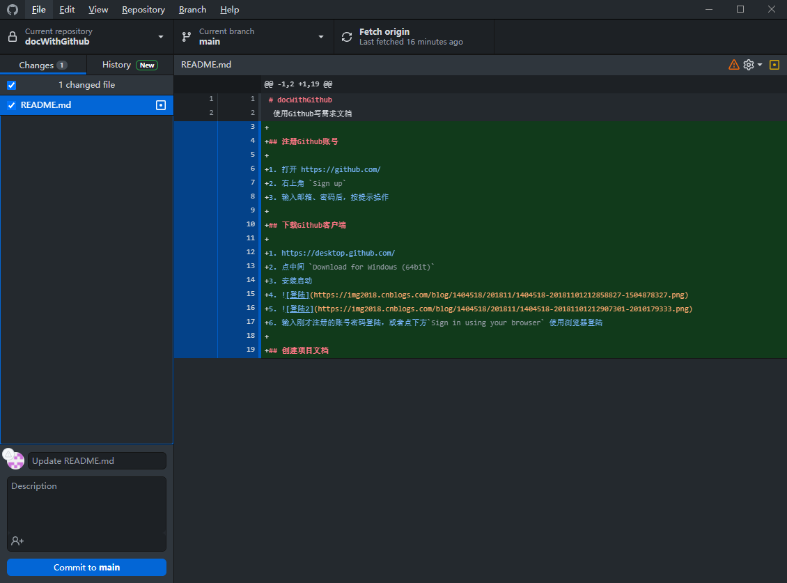

1. 点击 `File` - `New respository` ，打开创建项目界面

   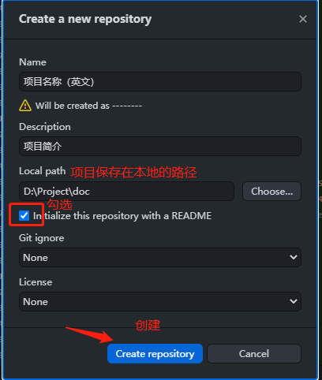

   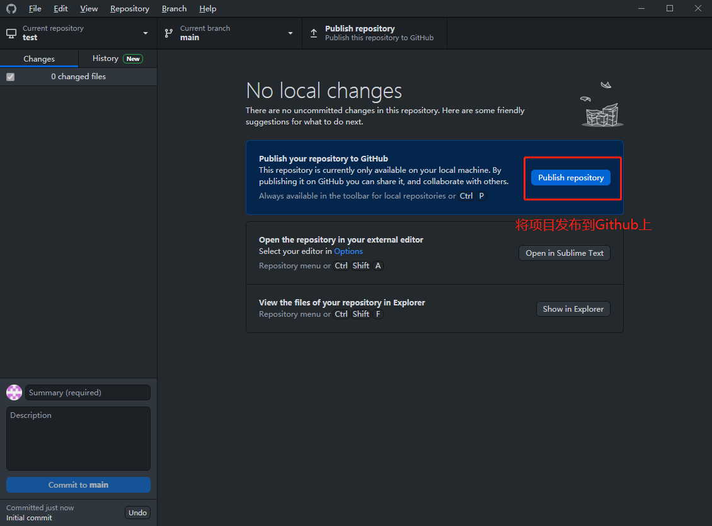

   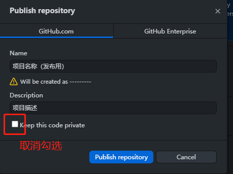

2. 点击 `Publish respository` 发布项目，得到下图则发布完成

   

3. 点击`View on Github`，在浏览器中打开该项目

## 邀请协助者

1. 协助者和项目创建者都可以修改项目内容、代码

2. 按1、2、3顺序点击

   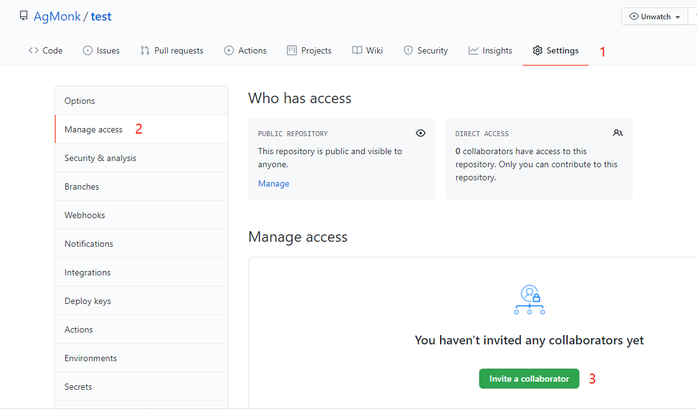

   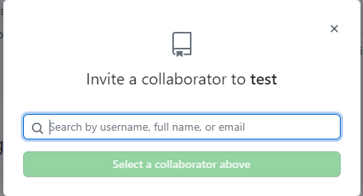

3. 输入前、后端开发人员的Github账号用户名或绑定的邮箱

   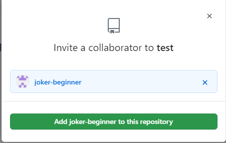

4. 点击`Add joker-beginner to this respository` 发出邀请

5. 被邀请人会在邮箱收到邀请邮件，或者可以点击下图红框复制邀请链接直接发给对方

   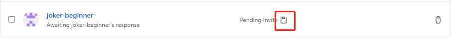

## 编辑文档

1. 用`Typora` 或其他 MarkDown 编辑器 打开 `项目目录下的 README.MD文件` 将文档内容书写在其中

2. 回到 Github 客户端，点击红框，会展示本地的项目列表

   

3. 选择刚才创建的项目，下方会展示本次修改的地方

4. 在左下角填写修改说明后，点击`Commit to main` 将本次修改提交到本地仓库，相当于打了一个备份记录点，之后可以随时还原到目前的状态。

   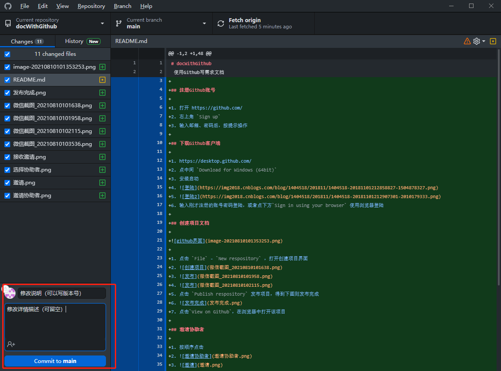

5. 点击`Push origin`，将本地仓库中的修改记录推送到云端仓库

   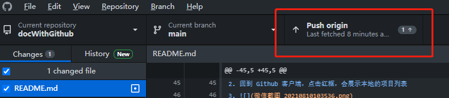

## 查看修改记录

1. 用浏览器打开项目主页，点击红框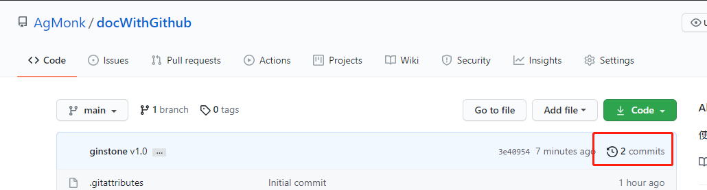

   

2. 得到该界面，每个红框中即为一次修改，和其对应的修改时间，点击可以看到修改详情

   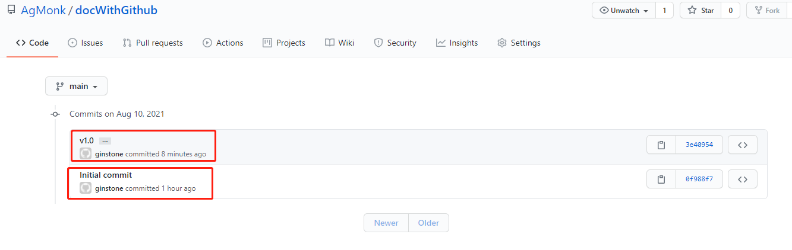

## 从云端同步项目到本地

1. **每次修改之前都必须先同步一次，确认当前状态后再修改，原则上同时只应该有一个人在修改项目**

2. 打开Github客户端

   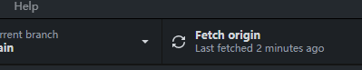

3. 点击`Fetch origin`如果有别人修改过项目文件或代码，该按钮会变成如下状态

   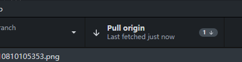

4. 点击`Pull origin` ，会把云端的修改记录同步到本地

5. 再重复“编辑文档”步骤即可
